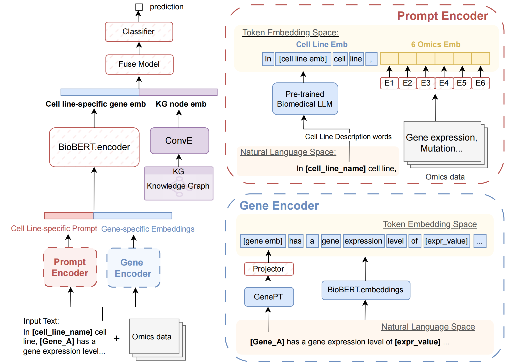

# PromptSL
PromptSL is a prompt-learning framework based on Biomedical Large Language Models (LLMs) for context-specific synthetic lethality (SL) prediction.

## Overview



## File Structure
```
PromptSL
├── data
│   ├── dataset_example
│   ├── KG
│   │   └── kge.py          
│   ├── omics_data          
│   ├── text_template       
│   └── utils.py            
├── src
│   ├── __pycache__         
│   ├── data_loader.py      
│   ├── data_prepare.py     
│   ├── evaluate.py         
│   ├── main.py             
│   ├── model.py            
│   ├── preprocess.py       
│   └── train.py            
├── environment.yml         
├── LICENSE                 
├── PromptSL_overview.png   
└── README.md               
```

## Requirements
To set up the environment for PromptSL, use the provided `environment.yml` file. You can create the necessary Conda environment with the following commands:

```bash
conda env create -f environment.yml
conda activate promptsl
```
A CUDA-enabled GPU is required to run the code efficiently. 


## Training and Evaluation

### Training
To train the PromptSL framework, run the `main.py` script. You can specify various hyperparameters using the command line or configuration files. Ensure that the paths to the datasets are correctly set in the `main.py` file.

Example command:
```bash
python -m src.main --cell_line all --predictor_lr 5e-4 --encoder_lr 1e-4 --projector_lr 1e-4 --om_encoder_lr 5e-4 --batch_size 16 --num_epochs 50 --early_stop_patience 6 --lr_patience 3 --weight_decay 1e-4 --device 0 
```

### Evaluation
To evaluate the trained model, use the `evaluate.py` script. 

Example command:
```bash
python -m src.evaluate 
```
The training results, logs, and saved models, as well as the evaluation results, will be saved in the `./save` folder. Ensure that the paths to the datasets and models are correctly set in the `evaluate.py` file.
